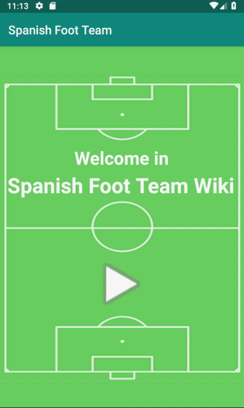
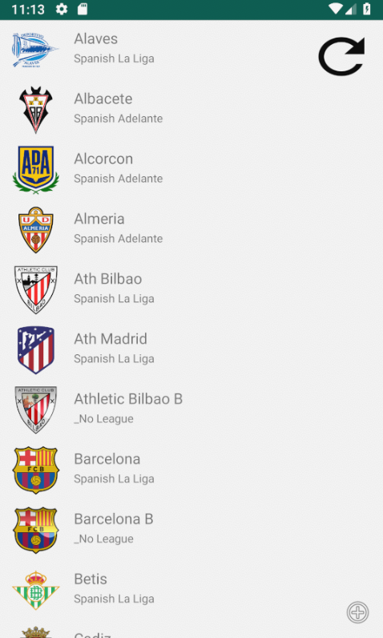
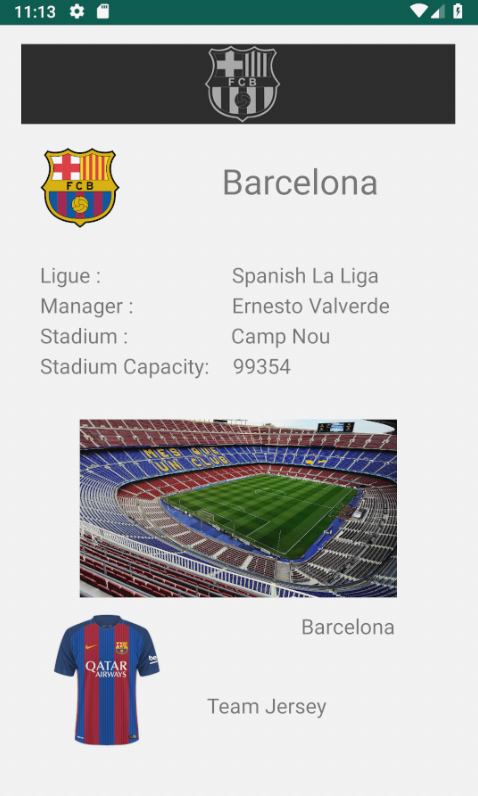

# Application Spanish Foot Team

## Projet réalisé par 

- Paul Leroy 3A

## Présentation

Simple projet démontrant l'utilisation de l'appel API Rest, et d'une Recycler View dans une application android.

Cette application affiche la liste des équipes de football Espagnol et utilise l'API du site https://www.thesportsdb.com .

## Prérequis


- Installation d'Android Studio<br/>


````
https://github.com/LePaulLeroy/MyFirstApp
````

## Consignes respectées : 

- Architecture MVC
- Appels REST
- Ecrans : 3 activités
- Affichage d'une liste dans un RecyclerView
- Affichage du détail d'un item de la liste
- Gitflow 
- Fonctions supplémentaires :
	- Mise en cache
	- Boutton de Refresh


## Fonctionnalités: 

### Premier écran 

- Menu de l'application



### Ecran Liste 

- Affiche la liste des clubs de foot avec un boutton refresh.

   

### Ecran du détail du clubs

- Affiche les différentes informations sur le club

 

